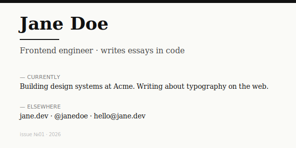
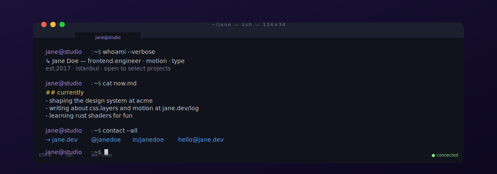

  

<h1 align="center">Awesome GitHub Profile</h1>

  <strong>Production-grade GitHub profile README templates.</strong> 
  From minimal type studies to 3D contribution skylines — copy, paste, ship.

  
  
  

---

## Why this exists

Every other "awesome profile README" project does one of three things: links to other people's profiles for inspiration, generates generic markdown from a form, or piles up unstyled examples that all look the same. **This one ships ready-to-paste, design-led templates** — nine categories, twenty templates at launch, every one held to a senior frontend bar.

The final category — **[Avant-Garde](#09--avant-garde--showcase-tier)** — is the showcase tier. Multi-layer `feTurbulence` + `feDisplacementMap` for living aurora flow. Animated 5-stop iridescent gradients with diagonal sheen sweeps for Pokemon-card foil. SVG path morphing through six topologically-equivalent geometric forms. Network graphs with 9 simultaneous signal pulses driven by `<animateMotion>`. These templates push the GitHub README format to its actual limits — everything still pure SVG, no script, no GIF.

You shouldn't have to be a designer to look like one on GitHub.

## How to use

1. **Browse the [categories](#categories)** below and pick a template that matches your tone.
2. **Open the template's folder** — every template has its own README with a copy-and-customize block.
3. **Replace the `{{placeholders}}`** (each template lists exactly which ones it uses) and paste into your `<your-username>/<your-username>` profile repo's `README.md`.

That's it. A few templates run a GitHub Action to generate live SVGs (the snake, the 3D contribution graph, the metrics pulse). For those, follow the one-time setup block in the template's README.

---

## Categories

### 01 · Minimal

> Less is more. Templates that earn attention through restraint.

<table border="0">
  <tr>
    <td width="50%" align="center" valign="top">
      <a href="./templates/01-minimal/editorial-card/">
        
         <strong>Editorial Card</strong>
      </a>
       Magazine-style serif. No deps.
    </td>
    <td width="50%" align="center" valign="top">
      <a href="./templates/01-minimal/monospace-cv/">
        
         <strong>Monospace CV</strong>
      </a>
       Profile as a terminal session.
    </td>
  </tr>
</table>

### 02 · Animated

> One focal motion done well — never a carnival.

<table border="0">
  <tr>
    <td width="50%" align="center" valign="top">
      <a href="./templates/02-animated/neon-pulse-banner/">
        
         <strong>Neon Pulse Banner</strong>
      </a>
       Wide gradient hero with a slow wave.
    </td>
    <td width="50%" align="center" valign="top">
      <a href="./templates/02-animated/typewriter-intro/">
        
         <strong>Typewriter Intro</strong>
      </a>
       A terminal that types itself in.
    </td>
  </tr>
</table>

### 03 · 3D & Immersive

> Depth, perspective, motion that hints at WebGL — running entirely on `<svg>`.

<table border="0">
  <tr>
    <td width="50%" align="center" valign="top">
      <a href="./templates/03-3d-immersive/3d-contribution-tower/">
        
         <strong>3D Contribution Tower</strong>
      </a>
       Your contributions as an isometric skyline.
    </td>
    <td width="50%" align="center" valign="top">
      <a href="./templates/03-3d-immersive/tech-sphere/">
        
         <strong>Tech Sphere</strong>
      </a>
       A rotating orbit of your stack.
    </td>
  </tr>
</table>

### 04 · Gamified

> Arcade-grade. Auto-updated by GitHub Actions.

<table border="0">
  <tr>
    <td width="50%" align="center" valign="top">
      <a href="./templates/04-gamified/snake-eat-graph/">
        
         <strong>Snake Eat Graph</strong>
      </a>
       The classic. Eats your contributions daily.
    </td>
    <td width="50%" align="center" valign="top">
      <a href="./templates/04-gamified/pacman-graph/">
        
         <strong>Pac-Man Graph</strong>
      </a>
       The louder cousin. Ghosts included.
    </td>
  </tr>
</table>

### 05 · Dashboard

> Stats-heavy templates that read like product analytics pages.

<table border="0">
  <tr>
    <td width="50%" align="center" valign="top">
      <a href="./templates/05-dashboard/analytics-grid/">
        
         <strong>Analytics Grid</strong>
      </a>
       2×2 metric cards. Dashboard energy.
    </td>
    <td width="50%" align="center" valign="top">
      <a href="./templates/05-dashboard/activity-pulse/">
        
         <strong>Activity Pulse</strong>
      </a>
       One card. Lots of signal. metrics-engine.
    </td>
  </tr>
</table>

### 06 · Designer Portfolio

> Visual, brand-driven, opinionated. For people whose work is the way it looks.

<table border="0">
  <tr>
    <td width="50%" align="center" valign="top">
      <a href="./templates/06-designer-portfolio/glassmorphism-hero/">
        
         <strong>Glassmorphism Hero</strong>
      </a>
       Frosted glass on a melting gradient.
    </td>
    <td width="50%" align="center" valign="top">
      <a href="./templates/06-designer-portfolio/editorial-magazine/">
        
         <strong>Editorial Magazine</strong>
      </a>
       Typeset like a small print quarterly.
    </td>
  </tr>
</table>

### 07 · Themed

> Strong aesthetic identity. Pick one and commit.

<table border="0">
  <tr>
    <td width="50%" align="center" valign="top">
      <a href="./templates/07-themed/cyberpunk-neon/">
        
         <strong>Cyberpunk Neon</strong>
      </a>
       Vaporwave grid + chromatic aberration.
    </td>
    <td width="50%" align="center" valign="top">
      <a href="./templates/07-themed/dark-elegant/">
        
         <strong>Dark Elegant</strong>
      </a>
       Monogram, gold hairline, restraint.
    </td>
  </tr>
</table>

### 08 · Markdown Tricks

> Two techniques that make every other template better. Use them inside whichever you pick.

<table border="0">
  <tr>
    <td width="50%" align="center" valign="top">
      <a href="./templates/08-markdown-tricks/light-dark-switcher/">
        
         <strong>Light / Dark Switcher</strong>
      </a>
       One <code>&lt;picture&gt;</code> tag, perfect parity.
    </td>
    <td width="50%" align="center" valign="top">
      <a href="./templates/08-markdown-tricks/collapsible-projects/">
        
         <strong>Collapsible Projects</strong>
      </a>
       Pack ten projects into the space of three.
    </td>
  </tr>
</table>

### 09 · Avant-Garde — showcase tier

> What the GitHub README format is *actually* capable of when you push every SVG primitive at once. No scripts, no GIFs, no external services — just SMIL animation, filter primitives, path morphing, and motion paths, composed with intent.

<table border="0">
  <tr>
    <td width="50%" align="center" valign="top">
      <a href="./templates/09-avant-garde/aurora-veil/">
        
         <strong>Aurora Veil</strong>
      </a>
       Multi-layer turbulence + displacement, never repeats.
    </td>
    <td width="50%" align="center" valign="top">
      <a href="./templates/09-avant-garde/holographic-foil/">
        
         <strong>Holographic Foil</strong>
      </a>
       Pokemon 1st-edition card, animated stop-color iridescence.
    </td>
  </tr>
  <tr>
    <td width="50%" align="center" valign="top">
      <a href="./templates/09-avant-garde/liquid-morph-wordmark/">
        
         <strong>Liquid Morph Wordmark</strong>
      </a>
       Path interpolation across six geometric forms.
    </td>
    <td width="50%" align="center" valign="top">
      <a href="./templates/09-avant-garde/neural-pulse-lattice/">
        
         <strong>Neural Pulse Lattice</strong>
      </a>
       10 nodes, 15 edges, 9 signals — animateMotion + mpath.
    </td>
  </tr>
</table>

---

## Full template index

| #  | Template                  | Category               | Difficulty   | External services                          |
|----|---------------------------|------------------------|--------------|--------------------------------------------|
| 01 | [Editorial Card](./templates/01-minimal/editorial-card/)                       | Minimal              | Basic        | none                                        |
| 02 | [Monospace CV](./templates/01-minimal/monospace-cv/)                           | Minimal              | Basic        | readme-typing-svg (optional)                |
| 03 | [Neon Pulse Banner](./templates/02-animated/neon-pulse-banner/)                | Animated             | Intermediate | none (self-hosted SVG)                      |
| 04 | [Typewriter Intro](./templates/02-animated/typewriter-intro/)                  | Animated             | Basic        | none (self-hosted SVG)                      |
| 05 | [3D Contribution Tower](./templates/03-3d-immersive/3d-contribution-tower/)    | 3D & Immersive       | Advanced     | github-profile-3d-contrib (Action)          |
| 06 | [Tech Sphere](./templates/03-3d-immersive/tech-sphere/)                        | 3D & Immersive       | Advanced     | none (self-hosted SVG)                      |
| 07 | [Snake Eat Graph](./templates/04-gamified/snake-eat-graph/)                    | Gamified             | Intermediate | Platane/snk (Action)                        |
| 08 | [Pac-Man Graph](./templates/04-gamified/pacman-graph/)                         | Gamified             | Intermediate | abozanona/pacman-contribution-graph (Action)|
| 09 | [Analytics Grid](./templates/05-dashboard/analytics-grid/)                     | Dashboard            | Intermediate | none for hero (optional readme-stats below) |
| 10 | [Activity Pulse](./templates/05-dashboard/activity-pulse/)                     | Dashboard            | Advanced     | lowlighter/metrics (Action)                 |
| 11 | [Glassmorphism Hero](./templates/06-designer-portfolio/glassmorphism-hero/)    | Designer Portfolio   | Advanced     | none (self-hosted SVG)                      |
| 12 | [Editorial Magazine](./templates/06-designer-portfolio/editorial-magazine/)    | Designer Portfolio   | Intermediate | none                                        |
| 13 | [Cyberpunk Neon](./templates/07-themed/cyberpunk-neon/)                        | Themed               | Advanced     | none (self-hosted SVG)                      |
| 14 | [Dark Elegant](./templates/07-themed/dark-elegant/)                            | Themed               | Intermediate | none for hero (optional readme-stats below) |
| 15 | [Light / Dark Switcher](./templates/08-markdown-tricks/light-dark-switcher/)   | Markdown Tricks      | Basic        | any image                                   |
| 16 | [Collapsible Projects](./templates/08-markdown-tricks/collapsible-projects/)   | Markdown Tricks      | Basic        | none                                        |
| 17 | [Aurora Veil](./templates/09-avant-garde/aurora-veil/)                         | Avant-Garde          | Advanced     | none (self-hosted SVG)                      |
| 18 | [Holographic Foil](./templates/09-avant-garde/holographic-foil/)               | Avant-Garde          | Advanced     | none (self-hosted SVG)                      |
| 19 | [Liquid Morph Wordmark](./templates/09-avant-garde/liquid-morph-wordmark/)     | Avant-Garde          | Advanced     | none (self-hosted SVG)                      |
| 20 | [Neural Pulse Lattice](./templates/09-avant-garde/neural-pulse-lattice/)       | Avant-Garde          | Advanced     | none (self-hosted SVG)                      |

---

## How this differs from other lists

|                                       | This repo | [awesome-github-profile-readme](https://github.com/abhisheknaiidu/awesome-github-profile-readme) | [awesome-github-profile-readme-templates](https://github.com/durgeshsamariya/awesome-github-profile-readme-templates) | [Profilinator](https://profilinator.rishav.dev/) / [GPRM](https://gprm.itsvg.in/) |
|---------------------------------------|:---------:|:---------:|:---------:|:---------:|
| Ready-to-paste markdown               | ✅        | ❌         | ✅         | ✅         |
| Design-led, opinionated templates     | ✅        | ❌         | ⚠️         | ❌         |
| Boundary-pushing SVG (turbulence, path morph, animateMotion) | ✅ | ❌ | ❌ | ❌ |
| 3D / immersive templates              | ✅        | ⚠️         | ❌         | ❌         |
| GitHub Action setup walkthroughs      | ✅        | ❌         | ❌         | ❌         |
| Light + dark mode parity              | ✅        | ❌         | ❌         | ⚠️         |
| Mobile-tested                         | ✅        | ❌         | ❌         | ❌         |
| Quality-bar enforced via PR template  | ✅        | ❌         | ❌         | n/a       |

`✅ yes  · ⚠️ partial · ❌ no`

---

## Contributing

Adding a new template? Read [`CONTRIBUTING.md`](CONTRIBUTING.md) — it documents the quality bar, the placeholder convention, and the PR process. Templates that don't clear the quality bar will be politely declined; templates that do are merged within a week.

If you found a bug (broken link, wrong placeholder, render glitch on mobile), open an issue or PR with a screenshot.

## Credits

This repo stands on the shoulders of the public services that make GitHub READMEs expressive. Each template lists its specific dependencies in its own `Credits` section. Maintainers we lean on most:

- [DenverCoder1](https://github.com/DenverCoder1) — readme-typing-svg, github-readme-streak-stats
- [kyechan99](https://github.com/kyechan99) — capsule-render
- [anuraghazra](https://github.com/anuraghazra) — github-readme-stats
- [Platane](https://github.com/Platane) — snk
- [yoshi389111](https://github.com/yoshi389111) — github-profile-3d-contrib
- [abozanona](https://github.com/abozanona) — pacman-contribution-graph
- [lowlighter](https://github.com/lowlighter) — metrics
- [tandpfun](https://github.com/tandpfun) — skill-icons

If your project is referenced and you'd like a different attribution wording, open an issue.

## License

[MIT](LICENSE) — use these templates anywhere, no attribution required (but appreciated).
