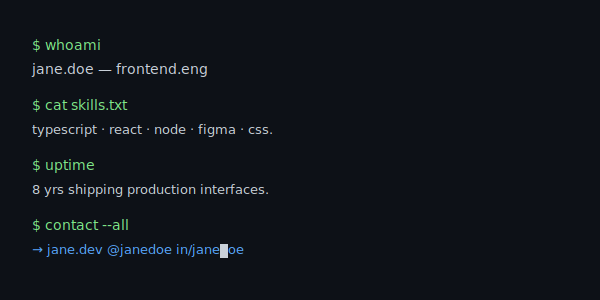

# Monospace CV



> Your profile as a terminal session. One font, four prompts, zero noise.

**Difficulty:** Basic
**External services:** [readme-typing-svg](https://github.com/DenverCoder1/readme-typing-svg) (optional, for the blinking cursor)
**Tags:** `minimal` `monospace` `terminal` `dev-aesthetic`

## Preview

Renders as a fenced code block, so GitHub's monospace + the dark code surface do the heavy lifting. Works in both themes. The optional typing SVG below the block adds a subtle blinking cursor; remove it if you want pure static output.

## Copy & Customize

````markdown
```bash
$ whoami
{{username}} — {{role}}

$ cat skills.txt
{{skills_csv}}

$ uptime
{{uptime_line}}

$ contact --all
→ {{website}}   @{{twitter}}   in/{{linkedin}}
```

<a href="{{website_url}}">
  
</a>
````

## Placeholders

| Token                  | Description                                    | Example                                            |
|------------------------|------------------------------------------------|----------------------------------------------------|
| `{{username}}`         | GitHub-style handle (lowercase + dot OK)       | `jane.doe`                                         |
| `{{role}}`             | Short role title                               | `frontend.eng`                                     |
| `{{skills_csv}}`       | Comma-separated skills                         | `typescript · react · node · figma`                |
| `{{uptime_line}}`      | Years of experience as a sentence              | `8 yrs shipping production interfaces.`            |
| `{{website}}`          | Domain only                                    | `jane.dev`                                         |
| `{{website_url}}`      | Full URL                                       | `https://jane.dev`                                 |
| `{{twitter}}`          | Twitter handle, no `@`                         | `janedoe`                                          |
| `{{linkedin}}`         | LinkedIn slug                                  | `janedoe`                                          |
| `{{accent}}`           | Hex color, no `#`, used for the typing cursor  | `7ee787`                                           |
| `{{typing_line_one}}`  | First rotating status                          | `currently shipping design tokens`                 |
| `{{typing_line_two}}`  | Second rotating status                         | `building a small synth in webaudio`               |
| `{{typing_line_three}}`| Third rotating status                          | `writing about css.layers`                         |

URL-encode the typing lines (replace spaces with `+` and special chars with `%XX`). The `;` is the line separator — keep it literal.

## Customization Tips

- **Strip the typing SVG** for a fully offline, zero-deps version — leave only the code block.
- **Pick a font** by changing `font=JetBrains+Mono` to `Fira+Code`, `IBM+Plex+Mono`, `Source+Code+Pro`, or `Space+Mono`.
- **Color palette:** GitHub dark code surface `#0d1117` · prompt `#7ee787` · text `#c9d1d9` · link `#58a6ff`. Don't override — these match GitHub's own theme on both light and dark.
- **Add a fifth prompt** if you have a public PGP key or a `.well-known` URL: `$ gpg --fingerprint` reads as quietly serious.

## Credits

- [readme-typing-svg](https://github.com/DenverCoder1/readme-typing-svg) by DenverCoder1 (MIT)
