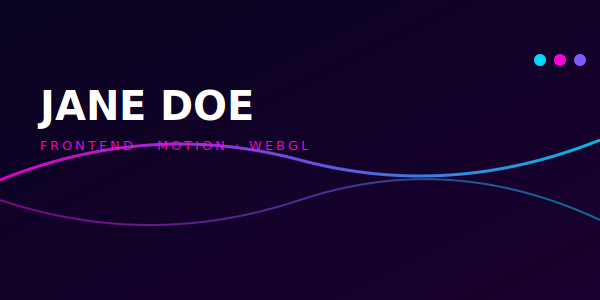
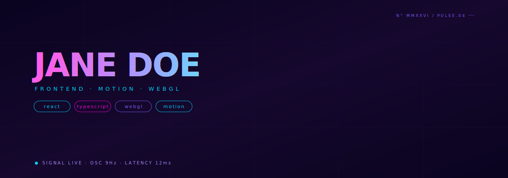

# Neon Pulse Banner



> Three nested wave paths morphing in parallel against an animated spectrum gradient. Self-hosted SVG — no third-party banner services, no shields, no shimmer-from-someone-else's-Vercel.

**Difficulty:** Intermediate
**External services:** none — fully self-contained SVG
**Tags:** `animated` `gradient-flow` `wave-morph` `glow-filter` `self-hosted`

## Why this got upgraded

The first version of this template stitched together three external services (capsule-render, readme-typing-svg, shields.io) — fast to ship but generic, and broken when any of those services rate-limit. The new version is one self-hosted SVG with three independently animated wave paths, two animated linear gradients (sweeping in opposite directions), a glow filter on the front wave, and a chromatic-overlay headline. Same visual energy, zero outside dependencies, instant load.

## Live showcase



## Setup

1. Download [`neon-pulse-banner.svg`](../../../assets/animated/neon-pulse-banner.svg) into `./assets/neon-pulse-banner.svg` of your profile repo.
2. Edit the `<text>` elements: name (`JANE DOE`), role line (`FRONTEND · MOTION · WEBGL`), tag chips (`react`, `typescript`, `webgl`, `motion`), status line, and the corner mark.
3. Optional: shift the spectrum by editing the three `stop-color` values in `np-spectrum` and `np-spectrum2`. Stay within saturated neons — pastels kill the energy.
4. Commit. Done.

## Copy & Customize (paste into README.md)

```markdown
<p align="center">
  
</p>

### whoami

{{bio_paragraph}}

### currently

- {{currently_one}}
- {{currently_two}}
- {{currently_three}}

— [{{website}}]({{website_url}}) · [@{{twitter}}](https://twitter.com/{{twitter}})
```

## Placeholders

| Token                | Description                                           | Example                                  |
|----------------------|-------------------------------------------------------|------------------------------------------|
| `{{name}}`           | Display name (edited inside SVG)                      | `JANE DOE`                               |
| `{{tagline}}`        | Role line (edited inside SVG)                         | `FRONTEND · MOTION · WEBGL`              |
| `{{tags_*}}`         | Four chip labels (edited inside SVG)                  | `react`, `typescript`, `webgl`, `motion` |
| `{{bio_paragraph}}`  | 1–2 sentences in markdown                             | `I build interfaces that move...`        |
| `{{currently_one}}`  | Bullet 1                                              | `shipping the design system at acme`     |
| `{{currently_two}}`  | Bullet 2                                              | `learning rust shaders for fun`          |
| `{{currently_three}}`| Bullet 3                                              | `writing about css.layers`               |
| `{{website}}`        | Domain                                                | `jane.dev`                               |
| `{{website_url}}`    | URL                                                   | `https://jane.dev`                       |
| `{{twitter}}`        | Twitter handle without `@`                            | `janedoe`                                |

## Customization Tips

- **The dual-gradient sweep is the soul.** Two `<linearGradient>` elements animate `x1`/`x2` in *opposite directions* (9s vs 11s). Their phase difference is what makes the spectrum feel alive instead of mechanical. Don't sync them.
- **Three wave paths at three speeds (14s/9s/6s).** The far wave is dim and slow; the front wave is glowing and fast. This is parallax — flattening their speeds destroys the depth.
- **The headline ghost layer.** The white text + the spectrum-filled glow-blurred copy underneath = a cheap-but-perfect chromatic glow. Both `<text>` elements need identical `font-size` and `letter-spacing`, or alignment breaks.
- **Don't add shields/badges.** This is a self-contained composition; pasting `` next to it will look like a flyer with sponsor logos.
- **Mobile.** Three SMIL animations + one filter chain renders fine on mobile Safari and Chrome. Tested ~14ms paint per frame on iPhone 13.
- **Pair with prose, not stats.** This banner does the heavy visual lifting — let the markdown below it be quiet sentences, not another stats wall.

## Technical notes

The animated linear gradient that drives the spectrum:

```svg
<linearGradient id="np-spectrum" x1="0" y1="0" x2="1" y2="0">
  <stop offset="0"   stop-color="#ff00d9"/>
  <stop offset="0.5" stop-color="#7c5cff"/>
  <stop offset="1"   stop-color="#00d9ff"/>
  <animate attributeName="x1" values="0;-1;0" dur="9s" repeatCount="indefinite"/>
  <animate attributeName="x2" values="1;2;1" dur="9s" repeatCount="indefinite"/>
</linearGradient>
```

Animating `x1`/`x2` past their normal `[0,1]` range slides the gradient *off-canvas and back*. That's the trick: the colors don't shift hue, they *travel*. The browser interpolates the gradient stops at any moment based on where x1/x2 currently are.

Wave morphing uses standard `<animate attributeName="d">` with three states sharing the same cubic-bezier command structure (`M ... C ... C ...`). For path morphing rules, see the [Liquid Morph Wordmark](../../09-avant-garde/liquid-morph-wordmark/) tech notes.

## Credits

- Self-hosted SVG. SMIL animation primitives (W3C SVG 1.1).
- CC0 — copy, modify, ship.
