# Typewriter Intro



> A pixel-perfect macOS terminal as your hero. Multiple `$` prompts, syntax-highlighted output, a single blinking cursor. Self-hosted SVG, zero dependencies on third-party typing services.

**Difficulty:** Basic
**External services:** none — fully self-contained SVG
**Tags:** `animated` `terminal` `macos-style` `monospace` `self-hosted`

## Why this got upgraded

The original relied on `readme-typing-svg.demolab.com` for the cursor effect — fine until the service rate-limits or your custom `lines=` URL-encoding breaks. The new version is one self-contained SVG with the full terminal UI rendered statically (window chrome, traffic lights, three prompts of syntax-highlighted output) and only the **cursor blink** as motion. Reads richer, loads faster, never breaks.

## Live showcase


## Setup

1. Download [`typewriter-intro.svg`](../../../assets/animated/typewriter-intro.svg) into `./assets/typewriter-intro.svg` of your profile repo.
2. Open in any text editor.
3. Edit the `<text>` elements grouped by prompt:
   - **Prompt 1** (`whoami --verbose`) — replace `Jane Doe — frontend.engineer · motion · type`, the metadata line.
   - **Prompt 2** (`cat now.md`) — replace the three bullet points under `## currently`.
   - **Prompt 3** (`contact --all`) — replace the four contact strings.
4. Optional: edit the window title (`~/jane — zsh — 124×34`) and the tab name (`jane@studio`).
5. Commit. Done.

## Copy & Customize (paste into README.md)

```markdown
<p align="center">
  
</p>

### projects on the desk

- [{{project_one_name}}]({{project_one_url}}) — {{project_one_desc}}
- [{{project_two_name}}]({{project_two_url}}) — {{project_two_desc}}
- [{{project_three_name}}]({{project_three_url}}) — {{project_three_desc}}

### writing

[`{{essay_one_title}}`]({{essay_one_url}}) · [`{{essay_two_title}}`]({{essay_two_url}})
```

## Placeholders

| Token                       | Description                                | Example                                          |
|-----------------------------|--------------------------------------------|--------------------------------------------------|
| `{{name}}`                  | Display name (edited inside SVG)           | `Jane Doe`                                       |
| `{{prompt_outputs_*}}`      | Three prompts' content (edited inside SVG) | `Jane Doe — frontend.engineer...`                |
| `{{project_one_*}}`         | First project name/URL/desc                | `acme-ds / .../jane/acme-ds / ...token-driven UI`|
| (etc. for two, three)       |                                            |                                                  |
| `{{essay_one_title}}`       | Essay link 1                               | `On the slowness of good interfaces`             |
| `{{essay_one_url}}`         | URL                                        | `https://jane.dev/log/slow`                      |
| `{{essay_two_title}}`       | Essay link 2                               | `Why I keep choosing CSS`                        |
| `{{essay_two_url}}`         | URL                                        | `https://jane.dev/log/css`                       |

## Customization Tips

- **Three prompts is the rhythm.** Two feels stunted; four overflows the window. The `whoami → cat now.md → contact --all` pattern is intentional: identity, current state, reach.
- **Syntax-color the right tokens.**
  - `#a78bfa` violet — the username (`jane@studio`)
  - `#7ee787` green — the prompt symbol (`$`) and command name
  - `#c9d1d9` near-white — output and arguments
  - `#fcd34d` amber — markdown headings (`## currently`)
  - `#58a6ff` blue — links and paths
  - `#7a7f99` muted — colons, separators, metadata
  These match GitHub's own syntax theme — visitors recognize the palette subconsciously.
- **The blinking cursor uses `keyTimes="0;0.5;0.5;1"` with values `1;1;0;0`.** That's the *square wave* blink — on for the first half, off for the second half. Smooth `1;0;1` gives a fade that reads as "loading", which you don't want.
- **The 14px traffic lights are slightly oversized.** Real macOS lights are 12px, but SVG anti-aliasing eats edges; bumping to 14 keeps them crisp.
- **`UTF-8 · zsh · ⌘K · clear` status bar at the bottom is optional.** It's the kind of detail that signals "this person uses a terminal daily" — a quiet authenticity flex.
- **Don't pair with another animated SVG above the fold.** One blinking cursor per profile is plenty.

## Technical notes

The cursor blink, with a square-wave timing instead of a smooth sine:

```svg
<rect x="252" y="360" width="9" height="14" fill="#c9d1d9">
  <animate attributeName="opacity"
           values="1;1;0;0"
           keyTimes="0;0.5;0.5;1"
           dur="1.1s" repeatCount="indefinite"/>
</rect>
```

The `keyTimes` array has duplicate `0.5` entries — that creates the *instant* on/off transition at exactly the halfway point of the 1.1s cycle. This is the difference between "modern smooth fade" and "real terminal cursor."

The `<filter id="ti-shadow">` is a 4-step drop shadow: blur the alpha, offset, attenuate, merge with source. That's what gives the terminal its "floating window" feel.

## Credits

- Self-hosted SVG. SMIL animation (W3C SVG 1.1).
- macOS terminal palette referenced from One Dark, GitHub Dark.
- CC0 — copy, modify, ship.
