# 3D Contribution Tower



> Your contribution graph as an isometric skyline. Tall bars are productive weeks; flat blocks are vacations.

**Difficulty:** Advanced
**External services:** [github-profile-3d-contrib](https://github.com/yoshi389111/github-profile-3d-contrib) (runs as a GitHub Action in your profile repo)
**Tags:** `3d` `isometric` `contribution-graph` `automated`

## Preview

A daily-updated SVG generated by a GitHub Action that lives inside your `<username>/<username>` profile repo. The Action reads your contribution data via the GraphQL API, ray-traces an isometric 3D image, and commits the result back as `profile-3d-contrib/profile-night-rainbow.svg` (or whichever style you pick).

This means the SVG isn't a third-party hotlink — it's a file you own, served from your own repo. **No external service runs on every README view.** That makes it fast, private, and reliable.

## Setup (one-time)

In your profile repo `<username>/<username>`, create the file `.github/workflows/profile-3d.yml`:

```yaml
name: GitHub-Profile-3D-Contrib

on:
  schedule:
    - cron: "17 5 * * *"   # daily at 05:17 UTC
  workflow_dispatch:

jobs:
  build:
    runs-on: ubuntu-latest
    name: generate 3d contribution svg
    steps:
      - uses: actions/checkout@v4
      - uses: yoshi389111/github-profile-3d-contrib@latest
        env:
          GITHUB_TOKEN: ${{ secrets.GITHUB_TOKEN }}
          USERNAME: {{username}}
        with:
          settings-file-path: ".github/profile-3d-settings.json"
```

Optional `profile-3d-settings.json` for color overrides (skip the file to use the default `profile-night-rainbow.svg` style):

```json
{
  "type": "season",
  "backgroundColor": "#0c1a36"
}
```

Push the workflow, then trigger it once manually from the **Actions** tab → **GitHub-Profile-3D-Contrib** → **Run workflow**. After ~30 seconds, the SVG is committed to `profile-3d-contrib/`.

## Copy & Customize (paste into README.md)

```markdown
<picture>
  <source media="(prefers-color-scheme: dark)" srcset="./profile-3d-contrib/profile-night-rainbow.svg">
  <source media="(prefers-color-scheme: light)" srcset="./profile-3d-contrib/profile-season.svg">
  
</picture>

### {{name}} — what these towers mean

- **Tall** weeks = pairing on greenfield work
- **Flat** stretches = vacations or deep-research weeks
- **Spiky** weekends = side projects, [{{website}}]({{website_url}})
```

## Placeholders

| Token             | Description                                      | Example                |
|-------------------|--------------------------------------------------|------------------------|
| `{{username}}`    | GitHub username (also the profile repo name)     | `janedoe`              |
| `{{name}}`        | Display name                                     | `Jane Doe`             |
| `{{website}}`     | Domain only                                      | `jane.dev`             |
| `{{website_url}}` | Full URL                                         | `https://jane.dev`     |

## Customization Tips

- **Pick the right style.** `profile-night-rainbow.svg` is the showy default. Calmer options the action emits include `profile-season.svg`, `profile-night-view.svg`, and `profile-gitblock.svg` — see the action's [README](https://github.com/yoshi389111/github-profile-3d-contrib) for the full list.
- **Use `<picture>` for dual-theme.** The snippet above flips between rainbow (dark mode) and season (light mode). It's the cleanest way to ship one image that works for everyone.
- **Verify the cron.** GitHub schedules run on the runner's clock; pick a quiet hour like `05:17 UTC` to avoid the on-the-hour rush which can delay your run by 5–10 minutes.
- **Workflow permissions.** The default `GITHUB_TOKEN` has write access to its own repo, so no PAT is needed. If your org enforces stricter token scopes, you'll need to enable `Actions → General → Workflow permissions: Read and write`.
- **Pair this with one minimal text block** — three sentences max. The 3D image is the hero; don't bury it under stats grids.

## Credits

- [github-profile-3d-contrib](https://github.com/yoshi389111/github-profile-3d-contrib) by yoshi389111 (MIT)
