# Pac-Man Contribution Graph



> Pac-Man eats your contribution dots while ghosts give chase. The snake template's louder cousin.

**Difficulty:** Intermediate
**External services:** [pacman-contribution-graph](https://github.com/abozanona/pacman-contribution-graph) (GitHub Action)
**Tags:** `gamified` `contribution-graph` `pacman` `automated` `retro`

## Preview

Same idea as Snake — but with arcade vibes. Pac-Man eats your contribution dots while four ghosts pursue. Runs as a GitHub Action; commits the generated SVG to your repo. Retro, playful, and immediately recognizable.

## Setup (one-time)

In your profile repo `<username>/<username>`, create `.github/workflows/pacman.yml`:

```yaml
name: Generate Pac-Man

on:
  schedule:
    - cron: "47 7 * * *"
  workflow_dispatch:
  push:
    branches:
      - main

jobs:
  generate:
    permissions:
      contents: write
    runs-on: ubuntu-latest
    steps:
      - uses: actions/checkout@v4

      - name: generate pacman contribution graph
        uses: abozanona/pacman-contribution-graph@main
        with:
          github_user_name: {{username}}
          theme: github
          output: dist/pacman-contribution-graph.svg

      - name: push to output branch
        uses: crazy-max/ghaction-github-pages@v4
        with:
          target_branch: output
          build_dir: dist
        env:
          GITHUB_TOKEN: ${{ secrets.GITHUB_TOKEN }}
```

Trigger once manually from the **Actions** tab to seed the `output` branch.

## Copy & Customize (paste into README.md)

```markdown
<p align="center">
  
</p>

<p align="center">
  <strong>{{name}}</strong> · <em>{{tagline}}</em>
</p>

<p align="center">
  <code>HIGH SCORE · {{commit_count}}</code> ·
  <code>STREAK · {{streak_days}}d</code> ·
  <code>STAGE · {{current_stage}}</code>
</p>

---

### currently

{{currently_paragraph}}

[{{website}}]({{website_url}}) · [@{{twitter}}](https://twitter.com/{{twitter}})
```

## Placeholders

| Token                  | Description                                       | Example                       |
|------------------------|---------------------------------------------------|-------------------------------|
| `{{username}}`         | GitHub username (also profile repo name)          | `janedoe`                     |
| `{{name}}`             | Display name                                      | `Jane Doe`                    |
| `{{tagline}}`          | One-liner                                         | `arcade-grade frontend`       |
| `{{commit_count}}`     | Optional flair — your commit total this year      | `1842`                        |
| `{{streak_days}}`      | Optional — current contribution streak            | `47`                          |
| `{{current_stage}}`    | Optional — what you're working on, framed as game | `senior eng @ acme`           |
| `{{currently_paragraph}}`| 1–2 sentences                                   | `Building...`                 |
| `{{website}}`          | Domain only                                       | `jane.dev`                    |
| `{{website_url}}`      | Full URL                                          | `https://jane.dev`            |
| `{{twitter}}`          | Twitter handle without `@`                        | `janedoe`                     |

## Customization Tips

- **Pick a theme.** The action ships `github`, `github-dark`, `github-light`. `github` auto-adapts — usually the right call.
- **Don't combine with the snake template.** Two animated arcade graphs = absolute carnival. Pick one and let it land.
- **The "HIGH SCORE" line is optional but it's the joke.** Without it, the template becomes a generic graph. Keep the labels short and uppercase.
- **Schedule honestly.** This action regenerates the full SVG, which takes 30–60 seconds. Once a day at an off-peak time is plenty — don't run it hourly.
- **Mobile note.** The graph is wide; on narrow screens GitHub will scale it down and Pac-Man becomes 4-pixels tall. Test in the GitHub mobile app before shipping.

## Credits

- [pacman-contribution-graph](https://github.com/abozanona/pacman-contribution-graph) by abozanona (MIT)
- [ghaction-github-pages](https://github.com/crazy-max/ghaction-github-pages) by crazy-max (MIT)
