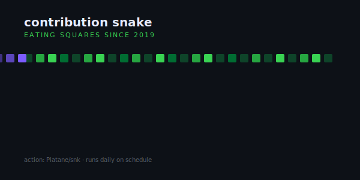

# Snake Eat Graph



> A snake that slithers across your contribution graph and eats every green square. Generated daily by GitHub Actions.

**Difficulty:** Intermediate
**External services:** [Platane/snk](https://github.com/Platane/snk) (GitHub Action)
**Tags:** `gamified` `contribution-graph` `snake` `automated` `picture-tag`

## Preview

A GitHub Action runs on a schedule, reads your contribution data, and generates two SVG/GIF files: one for light mode, one for dark mode. The README uses `<picture>` to show the right one to each visitor. The result is the snake game from your contribution wall — quietly mesmerizing.

## Setup (one-time)

In your profile repo `<username>/<username>`, create `.github/workflows/snake.yml`:

```yaml
name: Generate Snake

on:
  schedule:
    - cron: "23 6 * * *"     # daily at 06:23 UTC
  workflow_dispatch:
  push:
    branches:
      - main

jobs:
  generate:
    permissions:
      contents: write
    runs-on: ubuntu-latest
    steps:
      - name: generate snake game from contribution graph
        uses: Platane/snk/svg-only@v3
        with:
          github_user_name: {{username}}
          outputs: |
            dist/snake.svg
            dist/snake-dark.svg?palette=github-dark
            dist/snake.gif?color_snake=orange&color_dots=#bfd744,#64a338,#30903f,#1f6e2e,#0a4208

      - name: push to output branch
        uses: crazy-max/ghaction-github-pages@v4
        with:
          target_branch: output
          build_dir: dist
        env:
          GITHUB_TOKEN: ${{ secrets.GITHUB_TOKEN }}
```

The workflow commits the generated files to a separate `output` branch — they won't pollute your `main` history.

## Copy & Customize (paste into README.md)

```markdown
<picture>
  <source media="(prefers-color-scheme: dark)" srcset="https://raw.githubusercontent.com/{{username}}/{{username}}/output/snake-dark.svg" />
  <source media="(prefers-color-scheme: light)" srcset="https://raw.githubusercontent.com/{{username}}/{{username}}/output/snake.svg" />
  
</picture>

### {{name}}

> *{{tagline}}*

The snake above is built fresh every day — it's eating real commits, not props.

— [{{website}}]({{website_url}}) · [@{{twitter}}](https://twitter.com/{{twitter}})
```

## Placeholders

| Token             | Description                                | Example               |
|-------------------|--------------------------------------------|-----------------------|
| `{{username}}`    | GitHub username (also profile repo name)   | `janedoe`             |
| `{{name}}`        | Display name                               | `Jane Doe`            |
| `{{tagline}}`     | One-liner                                  | `frontend, daily.`    |
| `{{website}}`     | Domain only                                | `jane.dev`            |
| `{{website_url}}` | Full URL                                   | `https://jane.dev`    |
| `{{twitter}}`     | Twitter handle without `@`                 | `janedoe`             |

## Customization Tips

- **Color the snake.** In the workflow `outputs:` block, add `?color_snake=hex` (URL-encoded hex like `%237c5cff`). The default is GitHub-green which already matches the contribution palette — only override if your brand demands it.
- **Switch palette per theme.** `palette=github-light` and `palette=github-dark` are the two presets. The `<picture>` snippet uses them automatically.
- **Cron timing.** Pick an off-the-hour minute like `23` to dodge GitHub's hourly congestion. Hourly schedules with congested runners can delay 5–15 minutes.
- **Don't generate the GIF if you don't need it.** GIFs are heavy (often 1–3 MB) and most visitors will see the SVG first. Drop the `dist/snake.gif` line to keep your repo small.
- **Pair this with one minimal text block.** The snake is the focal point; sentences should be short and underneath, not above.
- **Permissions.** The workflow needs `contents: write` to push to the `output` branch — the snippet above already includes it. Don't grant broader scopes.

## Credits

- [Platane/snk](https://github.com/Platane/snk) by Platane (MIT)
- [ghaction-github-pages](https://github.com/crazy-max/ghaction-github-pages) by crazy-max (MIT)
