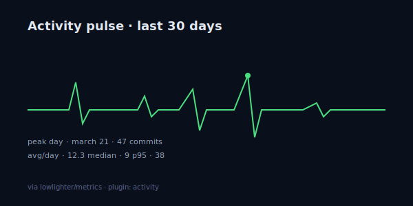

# Activity Pulse



> A single-card view of how you actually work. One line, lots of signal.

**Difficulty:** Advanced
**External services:** [lowlighter/metrics](https://github.com/lowlighter/metrics) (runs as a GitHub Action)
**Tags:** `dashboard` `single-card` `activity` `automated` `composable`

## Preview

`metrics` is the deepest stats engine for GitHub READMEs — it composes 30+ plugins into a single SVG. This template uses just two: `activity` (the pulse line) and `traffic` (peak day, median, p95). The result is the most informative single image you can put on a profile.

Because metrics runs as a GitHub Action and produces a static SVG committed to your repo, **rendering is instant and offline-resilient**. No live API calls when someone views your README.

## Setup (one-time)

In your profile repo `<username>/<username>`, create `.github/workflows/metrics.yml`:

```yaml
name: Metrics

on:
  schedule:
    - cron: "31 8 * * *"
  workflow_dispatch:
  push:
    branches:
      - main

jobs:
  pulse:
    runs-on: ubuntu-latest
    permissions:
      contents: write
    steps:
      - uses: lowlighter/metrics@latest
        with:
          token: ${{ secrets.METRICS_TOKEN }}
          user: {{username}}
          filename: metrics.activity.svg
          template: classic
          base: ""

          plugin_activity: yes
          plugin_activity_limit: 5
          plugin_activity_days: 30
          plugin_activity_filter: all

          plugin_traffic: yes

          plugin_lines: yes
          plugin_lines_history_limit: 1

          config_timezone: Europe/Istanbul
          config_padding: 0, 8 + 4%
          config_animations: yes
```

You'll need a personal access token with `repo` and `read:user` scopes, saved as `METRICS_TOKEN` in your repo's secrets. The default `GITHUB_TOKEN` doesn't have enough scope for some plugins.

## Copy & Customize (paste into README.md)

```markdown
<h1 align="center">{{name}}</h1>
<p align="center"><em>{{tagline}}</em></p>

<p align="center">
  
</p>

### how I work

- **Peak days are usually Tuesday–Thursday.** I deliberately avoid Mondays for deep work.
- **Long flat stretches** are research weeks — code shows up later as one big merge.
- **Spiky weekends** mean a side project is alive. Currently: [{{side_project_name}}]({{side_project_url}}).

— [{{website}}]({{website_url}}) · [@{{twitter}}](https://twitter.com/{{twitter}})
```

## Placeholders

| Token                   | Description                                          | Example                          |
|-------------------------|------------------------------------------------------|----------------------------------|
| `{{username}}`          | GitHub username                                      | `janedoe`                        |
| `{{name}}`              | Display name                                         | `Jane Doe`                       |
| `{{tagline}}`           | One-liner                                            | `frontend with a metrics habit`  |
| `{{side_project_name}}` | Current side project                                 | `the type observatory`           |
| `{{side_project_url}}`  | Side project URL                                     | `https://github.com/jane/tto`    |
| `{{website}}`           | Domain only                                          | `jane.dev`                       |
| `{{website_url}}`       | Full URL                                             | `https://jane.dev`               |
| `{{twitter}}`           | Twitter handle without `@`                           | `janedoe`                        |

## Customization Tips

- **Don't enable every plugin.** Metrics has 30+ plugins; turning them all on produces a wall-sized SVG that nobody reads. Two or three composes well; more becomes data dumping.
- **`config_animations: yes` is subtle.** It's a slow fade-in, not movement. Visitors won't see it after first load (browser caches the SVG) — but when they do see it, it's tasteful.
- **Token scopes matter.** `repo` (private repo data), `read:org` (org context), `read:user` (profile metadata). Do not use a token with broader scopes — metrics doesn't need write.
- **Schedule rarely.** Daily is enough; metrics runs are slow (1–3 minutes). Don't run hourly.
- **Pair with a 1-paragraph honest reflection.** The numbers are good; the *narrative* is what makes them stick. Three bullets explaining your patterns separates this from generic stats walls.
- **Filename consistency.** If you change `filename:` in the workflow, update the markdown `` to match. They must agree.

## Credits

- [lowlighter/metrics](https://github.com/lowlighter/metrics) by lowlighter (MIT)
