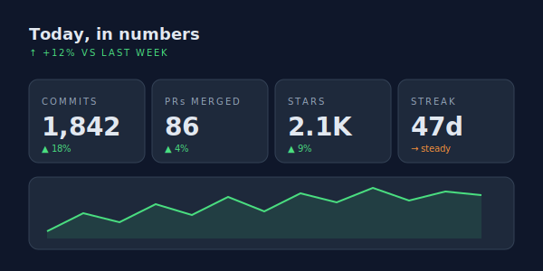

# Analytics Grid



> A four-tile executive dashboard with hand-drawn sparklines, a pulse-bar streak meter, weekday cadence dots, and a 90-day trend area chart with a live indicator. Self-hosted hero, optional external stat cards below.

**Difficulty:** Intermediate
**External services:** none for the hero; optional [github-readme-stats](https://github.com/anuraghazra/github-readme-stats) below
**Tags:** `dashboard` `kpi-tiles` `sparklines` `live-indicator` `self-hosted`

## Why this got upgraded

The first version was just four `` tags from public stat services — competent but generic, and the four cards had inconsistent typography because each service ships its own type system. The new version is **one cohesive SVG** with hand-drawn sparklines (real polylines, no charts library), a custom streak-bar meter, weekday cadence dots, and a 90-day trend chart with a pulsing "today" indicator. All four cards share one type scale. Looks like a product analytics page, not a sponsor wall.

You can still drop external stat cards below the hero for live data — but the hero itself stands on its own.

## Live showcase



## Setup

1. Download [`analytics-grid.svg`](../../../assets/dashboard/analytics-grid.svg) into `./assets/analytics-grid.svg` of your profile repo.
2. Open in any text editor.
3. Edit per tile:
   - **COMMITS · 30D** — replace `1,842` and `▲ 18%`. Adjust the sparkline `polyline points=` if you want it to reflect actual data — keep within the y-range `72-116`.
   - **STREAK · CURRENT** — replace `47d` and the longest-streak line.
   - **PRs MERGED · 30D** — replace `86` and the median-review line.
   - **CADENCE · 7D** — replace `tue→thu` and the bias percentage. Adjust which weekday dots are filled (cyan) vs unfilled (`#1a2540`).
   - **CONTRIBUTION VELOCITY** trend — leave as is for now (representative shape) or paste real polyline data.
4. Replace name/footer text.
5. Commit.

## Copy & Customize (paste into README.md)

```markdown
<p align="center">
  
</p>

### what these say

- **Commits trend up** because {{commit_reason}}
- **Streak is steady** because {{streak_reason}}
- **Cadence skews mid-week** because {{cadence_reason}}

### live data

<!-- Optional: drop github-readme-stats card here for actual real-time stats -->
<p align="center">
  
</p>

— [{{website}}]({{website_url}}) · [@{{twitter}}](https://twitter.com/{{twitter}})
```

## Placeholders

| Token                  | Description                                       | Example                              |
|------------------------|---------------------------------------------------|--------------------------------------|
| `{{name}}`             | Display name (edited inside SVG header)           | `JANE DOE`                           |
| `{{kpi_*}}`            | Four KPI numbers (edited inside SVG)              | `1,842 / 47d / 86 / tue→thu`         |
| `{{commit_reason}}`    | One sentence narrative                            | `the design system shipped milestone 3` |
| `{{streak_reason}}`    | One sentence narrative                            | `i blocked 30 minutes every morning` |
| `{{cadence_reason}}`   | One sentence narrative                            | `i protect mondays and fridays for deep work` |
| `{{username}}`         | GitHub username (for optional live card)          | `janedoe`                            |
| `{{website}}`          | Domain                                            | `jane.dev`                           |
| `{{website_url}}`      | URL                                               | `https://jane.dev`                   |
| `{{twitter}}`          | Twitter without `@`                               | `janedoe`                            |

## Customization Tips

- **Don't enable all 4 KPIs as identical metrics.** The four cards on purpose measure different *kinds* of things: a count (commits), a streak (days), a count with cadence (PRs), and a *pattern* (cadence). Replacing all four with "stars / forks / followers / watchers" makes it generic.
- **Sparkline within the tile, not across.** Each tile's sparkline lives within its own bounding box (`x: 18→238`, `y: 72→116`). Trying to draw one big chart across all four tiles breaks the modular feel.
- **Bar pulse on the latest streak day.** The right-most bar (`x=158, height=44`) animates between heights 38 and 44 — that's "today, still going". Move the animation to whichever bar represents your most recent day.
- **The live "today" indicator on the trend chart** is two concentric circles, one solid and pulsing, one outline pulsing on the same beat. The dot at `(1062, 40)` should be the right edge of your data — anchor it carefully.
- **Don't add a 5th card.** The 4-card top row + 1 wide trend chart is the dashboard *grammar*. Five tiles = report, four tiles = dashboard.
- **Color coding:**
  - Green (`#4ade80`) — healthy growth metrics (commits ▲)
  - Violet (`#a78bfa`) — temporal/streak metrics
  - Amber (`#fcd34d`) — quality metrics (PRs, review time)
  - Cyan (`#67e8f9`) — pattern/behavior metrics (cadence)
  Keep this mapping if you swap KPIs.
- **Pair with prose explanations**, not more numbers. The narrative below the hero is what makes data feel earned instead of vain.

## Technical notes

The pulsing live-indicator pattern:

```svg
<circle cx="1062" cy="40" r="4" fill="#fef3c7">
  <animate attributeName="r" values="4;7;4" dur="1.6s" repeatCount="indefinite"/>
</circle>
<circle cx="1062" cy="40" r="10" fill="none" stroke="#fef3c7" stroke-width="0.6">
  <animate attributeName="r" values="10;18;10" dur="1.6s" repeatCount="indefinite"/>
  <animate attributeName="opacity" values="0.6;0;0.6" dur="1.6s" repeatCount="indefinite"/>
</circle>
```

Two circles on the same beat: solid pulses small, outline pulses large and fades. That's the radar-blip pattern from monitoring tools like Datadog and Grafana. Visitors don't consciously recognize it, but they read it as "live."

The sparkline-with-gradient-fill technique: draw a `<polyline>` for the line, then a second `<polyline>` with the same points plus two corner points, filled with a vertical alpha gradient. Two elements, instant area chart.

## Credits

- Self-hosted SVG. SMIL animation (W3C SVG 1.1).
- Dashboard layout conventions from product-analytics tools (Vercel, Linear, PostHog).
- [github-readme-stats](https://github.com/anuraghazra/github-readme-stats) by anuraghazra (MIT) — optional, for the live card below the hero.
- CC0 — copy, modify, ship.
