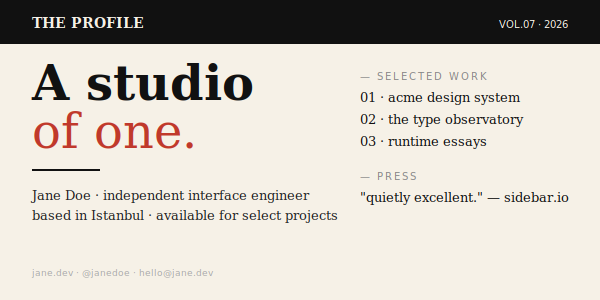

# Editorial Magazine



> A profile typeset like the cover of a small print quarterly. Two columns, one display serif, no images.

**Difficulty:** Intermediate
**External services:** none (pure HTML+markdown)
**Tags:** `designer-portfolio` `editorial` `serif` `two-column` `print-aesthetic`

## Preview

A wide black masthead with the magazine's title and a volume number; a giant two-line headline in display serif (with one word italicized as the accent); a left column of bio prose; a right column of selected work and press quotes; a small monospace footer with contact lines. Looks like print. Reads like respect.

## Copy & Customize

```markdown
<table align="center" border="0" width="100%" cellspacing="0" cellpadding="0">
  <tr>
    <td bgcolor="#111111" align="left" style="padding: 14px 28px;">
      <strong style="color:#f6f1e7; font-family:Georgia, serif; font-style:italic; letter-spacing:2px;">THE PROFILE</strong>
    </td>
    <td bgcolor="#111111" align="right" style="padding: 14px 28px;">
      <code style="color:#f6f1e7;">VOL.{{volume}} · {{year}}</code>
    </td>
  </tr>
</table>

<table align="center" border="0" width="100%" cellspacing="0" cellpadding="20">
  <tr>
    <td width="55%" valign="top">

# A studio<br><em>of one.</em>

**{{name}}** · {{role}}<br>
based in {{location}} · available for select projects

> "{{press_quote}}" — *{{press_outlet}}*

    </td>
    <td width="45%" valign="top">

###### — SELECTED WORK

01 · [{{work_one_name}}]({{work_one_url}})<br>
02 · [{{work_two_name}}]({{work_two_url}})<br>
03 · [{{work_three_name}}]({{work_three_url}})

###### — WRITING

[{{essay_one_name}}]({{essay_one_url}})<br>
[{{essay_two_name}}]({{essay_two_url}})

    </td>
  </tr>
</table>

---

<p align="center">
  <code>{{website}}</code> · <code>@{{twitter}}</code> · <code>{{email}}</code>
</p>
```

## Placeholders

| Token                  | Description                                  | Example                                          |
|------------------------|----------------------------------------------|--------------------------------------------------|
| `{{volume}}`           | Issue number                                 | `07`                                             |
| `{{year}}`             | Year                                         | `2026`                                           |
| `{{name}}`             | Display name                                 | `Jane Doe`                                       |
| `{{role}}`             | Role title                                   | `independent interface engineer`                 |
| `{{location}}`         | City/country                                 | `Istanbul`                                       |
| `{{press_quote}}`      | Single short quote                           | `quietly excellent`                              |
| `{{press_outlet}}`     | Quote attribution                            | `sidebar.io`                                     |
| `{{work_one_name}}`    | First project                                | `acme design system`                             |
| `{{work_one_url}}`     | First project URL                            | `https://github.com/jane/acme-ds`                |
| `{{work_two_name}}`    | Second project                               | `the type observatory`                           |
| `{{work_two_url}}`     | Second project URL                           | `https://typeobservatory.dev`                    |
| `{{work_three_name}}`  | Third project                                | `runtime essays`                                 |
| `{{work_three_url}}`   | Third project URL                            | `https://jane.dev/log`                           |
| `{{essay_one_name}}`   | First essay title                            | `On the slowness of good interfaces`             |
| `{{essay_one_url}}`    | First essay URL                              | `https://jane.dev/log/slow`                      |
| `{{essay_two_name}}`   | Second essay title                           | `Why I keep choosing CSS`                        |
| `{{essay_two_url}}`    | Second essay URL                             | `https://jane.dev/log/css`                       |
| `{{website}}`          | Domain only                                  | `jane.dev`                                       |
| `{{twitter}}`          | Twitter handle without `@`                   | `janedoe`                                        |
| `{{email}}`            | Email                                        | `hello@jane.dev`                                 |

## Customization Tips

- **The italicized word is the accent.** "*of one*" is what makes the headline land. Pick one word in your two-line headline and italicize it — it should be the *concept*, not the *noun*.
- **Don't add color.** GitHub will render most inline `style=` color attributes, but the editorial aesthetic depends on black, off-white, and one accent. Adding color makes it look like a Bootstrap landing page.
- **Press quote is optional but powerful.** If you don't have a quote, replace it with a single-sentence positioning statement: `> "I build the parts of products that nobody notices when they work."`
- **Three works, two essays.** Asymmetric counts feel hand-curated. Equal counts feel automated.
- **The volume number is the joke.** It implies you've been doing this a while. Pick a number that matches your years of experience minus three.
- **Background color note.** GitHub strips most CSS but keeps `bgcolor=` on `<td>` for legacy email-table compatibility. That's how the masthead gets its black bar — don't try to do it with `style=`.

## Credits

- No third-party services. Pure HTML email–style table layout for cross-renderer reliability.
