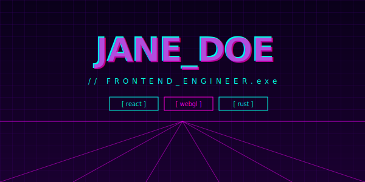

# Cyberpunk Neon



> Vaporwave perspective grid receding to a synthwave sun, chromatic-aberration title, animated scan line, and an honest-to-god jacked-in status pill. Self-hosted SVG, capsule-render-free.

**Difficulty:** Advanced
**External services:** none — fully self-contained SVG
**Tags:** `themed` `cyberpunk` `vaporwave` `chromatic-aberration` `self-hosted`

## Why this got upgraded

The first version stitched three external services together (capsule-render hero, readme-typing-svg status, github-readme-stats card) and depended on hex-encoded URL parameters that broke on every theme tweak. The new version is one self-hosted SVG with **all the synthwave clichés rendered properly**: vaporwave sun with horizontal scanline cuts, perspective grid floor with vanishing-point lines, distant mountain silhouette, scan-line that scrolls vertically, and a chromatic-aberration title (3 layered text elements with offset jitter).

## Live showcase



## Setup

1. Download [`cyberpunk-neon.svg`](../../../assets/themed/cyberpunk-neon.svg) into `./assets/cyberpunk-neon.svg` of your profile repo.
2. Edit the `<text>` elements:
   - Title (`JANE_DOE`) — appears in **four** layered `<text>` elements (magenta-glow, magenta, cyan, white). Replace all four with the same text.
   - Subtitle (`// FRONTEND.ENGINEER.exe`) — keep the `// ... .exe` framing.
   - Top corner stamps (`TOKYO.SECTOR_07 · 22:14`, `SIGNAL.STRENGTH 98%`).
   - Status pill (`JACKED IN · NEURAL UPLINK STABLE · UPTIME 2,184d`).
   - Tag list (`[ react ] [ webgl ] [ rust ] [ shaders ]`).
3. Optional: shift hue by editing `#ff00d9` (magenta) and `#00ffe7` (cyan) globally. **Stay loud.** Pastel cyberpunk doesn't exist.
4. Commit. Done.

## Copy & Customize (paste into README.md)

```markdown
<p align="center">
  
</p>

### // whoami

{{bio_lowercase}}

### // currently

- {{currently_one}}
- {{currently_two}}
- {{currently_three}}

### // contact

`{{website}}` · `@{{twitter}}` · `{{email}}`
```

## Placeholders

| Token                | Description                                       | Example                              |
|----------------------|---------------------------------------------------|--------------------------------------|
| `{{name}}`           | Title text, ALL_CAPS_WITH_UNDERSCORES (edit in SVG) | `JANE_DOE`                         |
| `{{role}}`           | Subtitle (edit in SVG)                            | `FRONTEND.ENGINEER`                  |
| `{{location_stamp}}` | Top-left corner (edit in SVG)                     | `TOKYO.SECTOR_07 · 22:14`            |
| `{{status_pill}}`    | Bottom-left phrase (edit in SVG)                  | `JACKED IN · NEURAL UPLINK STABLE`   |
| `{{tags_list}}`      | Four uppercase chip labels (edit in SVG)          | `[ react ] [ webgl ] [ rust ] [ shaders ]` |
| `{{bio_lowercase}}`  | 1–2 sentences in *lowercase only*                 | `i build interfaces that...`         |
| `{{currently_*}}`    | Three lowercase bullets                           | `shipping the design system...`      |
| `{{website}}`        | Domain                                            | `jane.dev`                           |
| `{{twitter}}`        | Handle without `@`                                | `janedoe`                            |
| `{{email}}`          | Email                                             | `hello@jane.dev`                     |

## Customization Tips

- **Lowercase everything in prose. Uppercase everything in chrome.** The contrast is the language. Mixing breaks the visual grammar.
- **The chromatic aberration uses three layered titles.** Magenta offset `(-3,1)`, cyan offset `(3,-1)`, white centered. The two color layers each have a separate `animateTransform translate` cycling through subtle jitter values — this is the *living* split that makes it feel like a CRT glitch, not a static drop shadow.
- **Don't slow the chromatic jitter.** `dur="0.18s"` is fast enough that the eye reads it as *vibration*, not *bouncing*. Anything slower than 0.3s reads as broken.
- **The vaporwave sun is the anchor.** Five horizontal black bars carved out of the sun (gradient yellow→magenta→purple) are the synthwave shorthand. Don't replace with a plain circle.
- **Mountain silhouette ties grid to sky.** The dark `<path>` between horizon and grid is what stops the composition from feeling like two unrelated halves. Don't remove it.
- **Status pill must be technical-sounding gibberish.** "JACKED IN", "NEURAL UPLINK", "SIGNAL.STRENGTH" — these are the genre's mandatory vocabulary. Don't write "ONLINE" or "AVAILABLE" — too tame.
- **No badges, no shield emojis, no friendly emoji.** This template is loud — every other element should be quiet text.

## Technical notes

The chromatic aberration trick:

```svg
<text x="600" y="158" fill="#ff00d9" opacity="0.85">
  <animateTransform attributeName="transform" type="translate"
                    values="-3 1;-2 -1;-3 1" dur="0.18s" repeatCount="indefinite"/>
  JANE_DOE
</text>
<text x="600" y="158" fill="#00ffe7" opacity="0.85">
  <animateTransform attributeName="transform" type="translate"
                    values="3 -1;2 1;3 -1" dur="0.18s" repeatCount="indefinite"/>
  JANE_DOE
</text>
<text x="600" y="158" fill="#fff8e7">JANE_DOE</text>
```

Three identical text elements, three different fills, two with subtle translation animations *in opposing directions*. The white center stays still; the magenta drifts left, the cyan drifts right, on the same 0.18s clock — out of phase. That's the chroma split.

The scrolling scanline is a single `<line>` with `y1`/`y2` animating from above-canvas to below-canvas over 3 seconds. Keep `stroke-width="1"` — anything thicker reads as a render glitch.

## Credits

- Self-hosted SVG. SMIL animation primitives (W3C SVG 1.1).
- Synthwave palette conventions referenced from late-80s VHS aesthetics.
- CC0 — copy, modify, ship.
