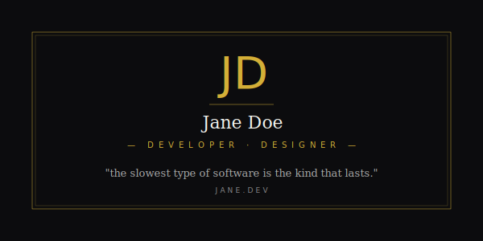

# Dark Elegant



> A monogrammed onyx portrait with a gold hairline frame, an italic display monogram, and an animated shimmer that sweeps gold across the letterforms once every six seconds. Like a hotel business card. Self-hosted SVG.

**Difficulty:** Intermediate
**External services:** none for the hero; optional transparent stats card below
**Tags:** `themed` `dark` `gold-shimmer` `monogram` `hotel-stationery` `self-hosted`

## Why this got upgraded

The original template referenced an `assets/dark-elegant-hero.svg` that didn't exist — readers had to build their own. The new asset is the actual hero: 1200×420, double gold hairline frame with corner brackets, 180px italic Playfair Display monogram with **a sweeping gold shimmer** (animated `<linearGradient>` rendered as overlay text), centered name in serif caps, mono uppercase tagline, italic epigraph, and a faint gold paper grain across the field.

The shimmer is the texture: gold dim → bright cream highlight → gold dim, traveling left-to-right every six seconds. Subtle. Expensive.

## Live showcase


## Setup

1. Download [`dark-elegant.svg`](../../../assets/themed/dark-elegant.svg) into `./assets/dark-elegant-hero.svg` of your profile repo.
2. Edit:
   - **Monogram** (`JD`) — appears in **three** layered `<text>` elements: glow halo, base, shimmer overlay. Replace all three with the same two letters (your initials).
   - **Name** (`Jane Doe`) — single `<text>` element below.
   - **Tagline** (`— DEVELOPER · DESIGNER —`) — keep the em-dashes wrapping the role.
   - **Epigraph** — replace with a one-line italic quote that means something.
   - **Top register** stamps and **bottom register** contact line.
3. Optional: shift gold by editing `#d4af37` (classic) globally. Warmer: `#c9a961`. Brighter: `#fde68a`.
4. Commit.

## Copy & Customize (paste into README.md)

```markdown
<p align="center">
  
</p>

---

### approach

{{approach_paragraph}}

### currently

{{currently_paragraph}}

### selected

> *{{project_one_name}}* — {{project_one_desc}}<br>
> *{{project_two_name}}* — {{project_two_desc}}

---

<p align="center">
  
</p>

<p align="center">
  <sub><code>{{website}}</code> · <code>@{{twitter}}</code> · <code>{{email}}</code></sub>
</p>
```

## Placeholders

| Token                    | Description                                  | Example                                |
|--------------------------|----------------------------------------------|----------------------------------------|
| `{{monogram}}`           | Two-letter italic mark (edit in SVG)         | `JD`                                   |
| `{{name}}`               | Full name in serif caps (edit in SVG)        | `Jane Doe`                             |
| `{{tagline}}`            | Tagline between em-dashes (edit in SVG)      | `— DEVELOPER · DESIGNER —`             |
| `{{epigraph}}`           | Italic quote (edit in SVG)                   | `"the slowest type of software..."`    |
| `{{location_stamps}}`    | Top register marks (edit in SVG)             | `EST. MMXVII / ATELIER · ISTANBUL · OSLO` |
| `{{approach_paragraph}}` | 2 sentences                                  | `Quiet practice. Long timelines.`      |
| `{{currently_paragraph}}`| 2 sentences                                  | `Shaping the design system at Acme...` |
| `{{project_*_name}}`     | Project name                                 | `acme design system`                   |
| `{{project_*_desc}}`     | One-liner                                    | `tokens shipped to 14 teams`           |
| `{{username}}`           | GitHub username                              | `janedoe`                              |
| `{{website}}`            | Domain                                       | `jane.dev`                             |
| `{{twitter}}`            | Twitter without `@`                          | `janedoe`                              |
| `{{email}}`              | Email                                        | `hello@jane.dev`                       |

## Customization Tips

- **The shimmer is the entire point.** It runs every 6 seconds — slow enough to feel atmospheric, fast enough that visitors who *only* glance at your README still catch one cycle. Don't speed it up; don't slow it down.
- **Three layered monogram texts** — glow halo (low alpha, blurred), base (gold gradient fill), shimmer overlay (animated gradient). They must all share the *exact same* `font-size`, `letter-spacing`, and position. Even 1px misalignment will ghost the letters.
- **The shimmer gradient is sharp, not smooth.** Stops at offset `0.42 / 0.5 / 0.58` create a *narrow* highlight band, not a wide wash. Wide bands look like a filter glitch; narrow bands look like real reflected light.
- **Gold + onyx is non-negotiable.** Any third color introduces a hierarchy this design doesn't want. The frame, monogram, tagline, and dividers are *all* gold; the type is white-ish; the field is onyx. Three values, not four.
- **The four corner brackets are tiny `<path>` elements** — `M 60 76 L 60 60 L 76 60` etc. They suggest a print mark. Replacing them with full corner rectangles makes it look templated.
- **Epigraph hierarchy:** italic, lower contrast (`#a3a3a3`), one line max. If your quote runs two lines, find a shorter one. The page can't carry a long quote on this scale.
- **The transparent stats card** below uses `bg_color=00000000` (alpha-zero hex) — it disappears into whatever surface visitors view from. Don't override `bg_color` to a solid color; it'll create a second card that competes with the hero.
- **No emojis. No badges. No icons.** Anything visual breaks the restraint. Mention technologies inline in prose: *"built with restraint, TypeScript, and a healthy paranoia about state."*

## Technical notes

The gold shimmer gradient + sweep:

```svg
<linearGradient id="de-shimmer" x1="0" y1="0" x2="1" y2="0">
  <stop offset="0"   stop-color="#d4af37" stop-opacity="0"/>
  <stop offset="0.42" stop-color="#d4af37" stop-opacity="0"/>
  <stop offset="0.5" stop-color="#fde68a"/>
  <stop offset="0.58" stop-color="#d4af37" stop-opacity="0"/>
  <stop offset="1"   stop-color="#d4af37" stop-opacity="0"/>
  <animate attributeName="x1" values="-1;1;-1" dur="6s" repeatCount="indefinite"/>
  <animate attributeName="x2" values="0;2;0" dur="6s" repeatCount="indefinite"/>
</linearGradient>
```

The gradient is **mostly transparent** — only a 16%-wide band around offset `0.5` carries the bright cream highlight. As `x1`/`x2` slide from `-1→1` and `0→2`, that bright band travels across the text. Three layered text elements (glow / base / shimmer overlay), the shimmer overlay filled with this gradient, applied on top of the gold base. The result reads as light moving across letterforms.

Returning the `x` values back (`-1` not `2`) creates a smooth oscillation; using `to`-style one-way animation creates a frame-snap reset. Always oscillate.

The paper grain is `feTurbulence` `baseFrequency="1.2"` colored gold-tinted via `feColorMatrix` at 2.5% alpha. Subliminal warm texture; doesn't compete with the monogram.

## Credits

- Self-hosted SVG. SMIL animation + filter primitives.
- [github-readme-stats](https://github.com/anuraghazra/github-readme-stats) by anuraghazra (MIT) — optional, for the transparent stats card.
- Letterform conventions referenced from luxury hotel stationery.
- CC0 — copy, modify, ship.
