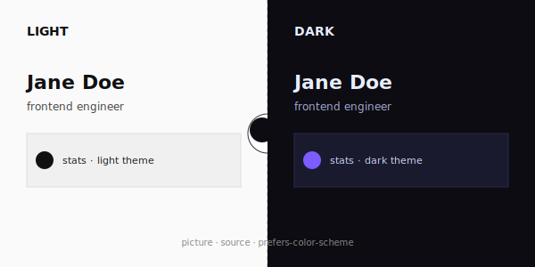

# Light / Dark Switcher



> One `<picture>` tag, two source files, perfect theme parity. The single most useful trick on this list.

**Difficulty:** Basic
**External services:** any image-emitting service of your choice
**Tags:** `tricks` `picture-tag` `dark-mode` `prefers-color-scheme` `composable`

## Preview

This isn't a layout — it's a **technique** you should embed inside any of the other templates. GitHub respects the HTML `<picture>` element with `media="(prefers-color-scheme: dark)"` source attributes. That means a single image slot in your README can render two completely different files based on the visitor's system theme.

## How it works

```html
<picture>
  <source media="(prefers-color-scheme: dark)" srcset="path/to/dark.svg">
  <source media="(prefers-color-scheme: light)" srcset="path/to/light.svg">
  
</picture>
```

GitHub's renderer:
- Reads the user's `prefers-color-scheme` (system theme, *not* GitHub's theme toggle — there's a subtle difference).
- Picks the matching `<source>` and uses its `srcset`.
- Falls back to `` if neither source matches.

The `` `alt` is mandatory — it appears for screen readers and when both sources fail.

## Copy & Customize — three useful patterns

### 1. Theme-aware stats card

```markdown
<picture>
  <source media="(prefers-color-scheme: dark)" srcset="https://github-readme-stats.vercel.app/api?username={{username}}&show_icons=true&theme=tokyonight&hide_border=true">
  <source media="(prefers-color-scheme: light)" srcset="https://github-readme-stats.vercel.app/api?username={{username}}&show_icons=true&theme=default&hide_border=true">
  
</picture>
```

### 2. Theme-aware logo or hero image

Useful when your project has a light wordmark and a dark wordmark.

```markdown
<picture>
  <source media="(prefers-color-scheme: dark)" srcset="./assets/logo-dark.svg">
  <source media="(prefers-color-scheme: light)" srcset="./assets/logo-light.svg">
  
</picture>
```

### 3. Theme-aware contribution graph (snake template)

```markdown
<picture>
  <source media="(prefers-color-scheme: dark)" srcset="https://raw.githubusercontent.com/{{username}}/{{username}}/output/snake-dark.svg">
  <source media="(prefers-color-scheme: light)" srcset="https://raw.githubusercontent.com/{{username}}/{{username}}/output/snake.svg">
  
</picture>
```

## Placeholders

| Token             | Description                                | Example                          |
|-------------------|--------------------------------------------|----------------------------------|
| `{{username}}`    | GitHub username                            | `janedoe`                        |
| `{{project_name}}`| Project name (for alt text)                | `acme design system`             |

## Customization Tips

- **Always provide `` alt.** Not optional — it's required for accessibility, and it's what feed readers, RSS aggregators, and search crawlers will see.
- **Order matters.** GitHub takes the first matching `<source>`. Put `dark` first if your default is dark; either order works as long as `` provides the fallback.
- **Filename hint, not requirement.** `-dark` and `-light` suffixes are convention; you can name files anything as long as both URLs resolve.
- **Don't nest `<picture>` inside `<a>` for hotlinked SVGs.** GitHub strips the link sometimes; instead, wrap the whole thing in markdown link syntax: `[](href)` or use an explicit `<a><picture>...</picture></a>` and confirm in preview.
- **Test with both themes.** Toggle your OS theme (or use the browser dev tools `prefers-color-scheme` emulator) and reload the README to verify both sources fire correctly.
- **Watch caching.** If you change one of the source SVGs, GitHub caches images for several hours. Force a refresh by appending a `?v=2` query string.

## Credits

- HTML `<picture>` element behavior — [GitHub Docs: Specifying themed images](https://docs.github.com/en/get-started/writing-on-github/getting-started-with-writing-and-formatting-on-github/basic-writing-and-formatting-syntax#specifying-the-theme-an-image-is-shown-to)
