# Aurora Veil


> A living aurora that never repeats. Multi-layer `<feTurbulence>` + `<feDisplacementMap>` with animated seeds — the SVG renders fresh frames forever, on a static image tag.

**Difficulty:** Advanced
**External services:** none — fully self-contained SVG
**Tags:** `avant-garde` `turbulence` `displacement` `animated-filter` `editorial`

## Why this is different

Most "animated" GitHub READMEs cycle a typing line or wave a banner. This one **continuously regenerates organic flow** by animating `feTurbulence`'s `seed` and `baseFrequency` while a `feDisplacementMap` warps gradient ribbons through it. Three displacement layers run at three different speeds; the result reads as cosmic depth, not loops.

The catch: heavy SVG filters cost a few ms of paint per frame. GitHub's renderer handles it fine on desktop and modern mobile — but this is one of the few templates where the rendering itself is part of the craft.

## Live showcase

The full hero (1200×420):



## Setup

1. Download [`aurora-veil.svg`](../../../assets/avant-garde/aurora-veil.svg) from this repo into `./assets/aurora-veil.svg` of your profile repo.
2. Open in any text editor.
3. Edit the `<text>` elements at the bottom — replace `Jane Doe`, the role line, and the coordinates.
4. Optional: shift the palette by editing the three gradient stops near the top (`#3fffe6` teal, `#ff3d8a` magenta, `#f4d35e` amber). Stay within one temperature family or you break the aesthetic.
5. Commit. Done.

## Copy & Customize (paste into README.md)

```markdown
<p align="center">
  
</p>

<table align="center" width="80%" border="0">
  <tr>
    <td valign="top" align="left">

### currently
{{currently_paragraph}}

### writing
{{writing_paragraph}}

    </td>
    <td valign="top" align="right" width="36%">
      <em>"{{epigraph}}"</em><br>
      <sub>— {{epigraph_attribution}}</sub><br><br>
      <a href="{{website_url}}">{{website}}</a><br>
      <a href="https://twitter.com/{{twitter}}">@{{twitter}}</a>
    </td>
  </tr>
</table>
```

## Placeholders

| Token                       | Description                                | Example                                              |
|-----------------------------|--------------------------------------------|------------------------------------------------------|
| `{{name}}`                  | Name (edited inside the SVG `<text>`)      | `Jane Doe`                                           |
| `{{tagline}}`               | Role line (edited inside SVG)              | `DESIGNER · ENGINEER · OBSERVER`                     |
| `{{currently_paragraph}}`   | 1–2 sentences                              | `Building a quiet design system at Acme...`         |
| `{{writing_paragraph}}`     | 1–2 sentences                              | `Notes on motion and color at jane.dev/log.`        |
| `{{epigraph}}`              | Short literary line                        | `we are made of light, deadlines, and Pacific time` |
| `{{epigraph_attribution}}`  | Source                                     | `the journal, vol. iii`                              |
| `{{website}}`               | Domain                                     | `jane.dev`                                           |
| `{{website_url}}`           | URL                                        | `https://jane.dev`                                   |
| `{{twitter}}`               | Twitter handle without `@`                 | `janedoe`                                            |

## Customization Tips

- **The seed animation is the soul.** Don't shorten the `dur="40s"` on `<animate attributeName="seed">` — the slowness is what makes the flow feel atmospheric instead of frantic. Faster turbulence reads as TV static.
- **Three gradient temperatures, same family.** Teal + magenta + amber land here because they're all *vivid but desaturated*. Don't substitute pure red, pure green, or pure blue — they'll punch holes in the cohesion.
- **Mountain ridge is the editorial anchor.** The polygon at `y=300` is your horizon. Without it, type floats; with it, type sits. Keep the points jagged, not smooth.
- **`stdDeviation="1.2"` on the headline glow** is the difference between *editorial* and *cheesy*. Bumping it past 2 makes the type look like a Geocities banner. Stay under 1.5.
- **Don't add badges.** Don't add a stats card on top. The veil is the visual; everything else lives in prose underneath.
- **Mobile.** Test in the GitHub mobile app — the displacement filter is GPU-accelerated on iOS Safari and Android Chrome, but on older devices the aurora may look static. That's an acceptable degradation; the static palette still reads.
- **Performance.** This SVG paints at ~12-16 ms per frame on a mid-range laptop. Only one filter-heavy hero per page, please.

## Technical notes (for the curious)

The interesting machinery:

```svg
<filter id="av-flow1">
  <feTurbulence type="fractalNoise" baseFrequency="0.006 0.022" numOctaves="3" seed="2">
    <animate attributeName="baseFrequency" values="…" dur="24s" repeatCount="indefinite"/>
    <animate attributeName="seed" from="0" to="40" dur="40s" repeatCount="indefinite"/>
  </feTurbulence>
  <feDisplacementMap in="SourceGraphic" in2="..." scale="90"/>
</filter>
```

- `fractalNoise` (vs. `turbulence`) gives smoother, cloud-like patterns — better for aurora than the default's high-frequency static.
- Two animations on one `<feTurbulence>` element work in parallel — `baseFrequency` morph + `seed` drift. Together they produce non-repeating flow.
- `feDisplacementMap` warps the source (a gradient rectangle) using the turbulence as a vector field.
- Three filters at three `scale` values (90/70/48) create parallax: front layers move more.

## Credits

- SVG SMIL animation primitives (W3C) — [SVG 1.1 Filters spec](https://www.w3.org/TR/SVG11/filters.html)
- Original composition for this kit. CC0 — copy, modify, ship.
