# Holographic Foil


> Your profile as a 1st-edition holographic trading card. Animated stop-color iridescence + skewed sheen sweep + orbiting highlight + crystal-scale pattern. The kind of thing people screenshot.

**Difficulty:** Advanced
**External services:** none — fully self-contained SVG
**Tags:** `avant-garde` `holographic` `trading-card` `animated-gradient` `playful-luxury`

## Why this is different

Holographic effects on the web usually need WebGL or canvas. This template gets *Pokemon-1st-edition Charizard* energy from pure SVG by stacking five tricks:

1. **Animated `stop-color` on a 5-stop gradient** — colors cycle through the iridescent rainbow on every stop independently, offset in phase. Result: the foil never settles.
2. **Crystal-scale `<pattern>`** — tiny diamond paths tiled across the card, exactly like the foil scale pattern on a real holographic card.
3. **Diagonal sheen sweep** — a `<rect>` filled with a white-transparent-white linear gradient, skewed `-22°`, animated horizontally across the card every 6 s. This is the thing your eye actually catches.
4. **Orbiting radial highlight** — `<radialGradient>` with `cx`/`cy` animating in a slow figure-8.
5. **Vignette for depth** — keeps the corners dark so the foil layer reads as concentrated, not washed-out.

## Live showcase



## Setup

1. Download [`holographic-foil.svg`](../../../assets/avant-garde/holographic-foil.svg) into `./assets/holographic-foil.svg` of your profile repo.
2. Edit the `<text>` elements: `JANE DOE`, the role+level, the HP number, monogram (`JD`), and the three ability rows.
3. Pick your three ability colors — they're the small numerical scores. Pull them from the foil palette: `#fcd34d` (gold), `#a78bfa` (violet), `#67e8f9` (cyan), `#f472b6` (magenta), `#6ee7b7` (mint).
4. Commit. Done.

## Copy & Customize (paste into README.md)

```markdown
<p align="center">
  
</p>

### dossier

{{bio_paragraph}}

### encounters

- **{{currently_one_label}}** · {{currently_one_text}}
- **{{currently_two_label}}** · {{currently_two_text}}
- **{{currently_three_label}}** · {{currently_three_text}}

### find

[{{website}}]({{website_url}}) · [@{{twitter}}](https://twitter.com/{{twitter}}) · [in/{{linkedin}}](https://linkedin.com/in/{{linkedin}})
```

## Placeholders

| Token                    | Description                                            | Example                                  |
|--------------------------|--------------------------------------------------------|------------------------------------------|
| `{{name}}`               | Display name (edited inside SVG)                       | `JANE DOE`                               |
| `{{role}}`               | Role (edited inside SVG)                               | `FRONTEND ENGINEER`                      |
| `{{level}}`              | Years of experience as a "level" (edited inside SVG)   | `7`                                      |
| `{{hp}}`                 | A number that means something (commits, days streak)   | `2,184`                                  |
| `{{monogram}}`           | Two-letter italic monogram (edited inside SVG)         | `JD`                                     |
| `{{ability_one_*}}`      | Ability label, score, sublabel (edited inside SVG)     | `⚡ Type System Mastery / 86 / strict.tsconfig…` |
| `{{ability_two_*}}`      | Same                                                   | `🌊 Motion Choreography / 94 / framer.motion…`  |
| `{{ability_three_*}}`    | Same                                                   | `✦ Design System Architecture / 91 / tokens…`   |
| `{{bio_paragraph}}`      | 1–2 sentences                                          | `Trades rare type systems...`            |
| `{{currently_*}}`        | Three short bullets in markdown                        | `Acme · shipping the design system...`   |
| `{{website}}`            | Domain                                                 | `jane.dev`                               |
| `{{website_url}}`        | URL                                                    | `https://jane.dev`                       |
| `{{twitter}}`            | Twitter handle without `@`                             | `janedoe`                                |
| `{{linkedin}}`           | LinkedIn slug                                          | `janedoe`                                |

## Customization Tips

- **Ability emoji is the personality.** ⚡🌊✦ are deliberate (electric / fluid / star). Avoid 🚀💯🔥 — they read as recruiter-bait. One symbol per ability, lowercase technical wording in the sublabel.
- **HP is whatever number flatters you.** Total commits, longest streak, GitHub stars. Don't use age. Don't use salary.
- **Edition stamp is the joke.** "1ST EDITION" works because it implies scarcity. Don't replace with "2025 / 2026" — kills the gag.
- **Five-star rarity reads as confidence, not arrogance.** It's a card-game trope; people read it tongue-in-cheek. If you want quieter: `★★★☆☆ UNCOMMON`, `★★★★☆ RARE`.
- **Don't change the sheen `dur="6s"`.** Slower than 8s and it feels static; faster than 4s and it feels like a sale popup. 6 seconds is the goldilocks.
- **Pair with playful prose.** "dossier", "encounters", "find" — the section labels should match the trading-card metaphor. "About me / Skills / Contact" breaks the spell.
- **Card dimensions are intentionally `880×400` inside `1200×480`.** The breathing room around the card is what makes it feel like a *card*, not a banner. Don't make it edge-to-edge.

## Technical notes

```svg
<linearGradient id="hf-foil">
  <stop offset="0" stop-color="#67e8f9">
    <animate attributeName="stop-color"
             values="#67e8f9;#f472b6;#fcd34d;#6ee7b7;#a78bfa;#67e8f9"
             dur="14s" repeatCount="indefinite"/>
  </stop>
  ...4 more stops, each cycling out of phase
</linearGradient>
```

Each stop animates through the same five-color sequence but starts at a different offset in the cycle — so at any moment, you have five different iridescent colors in play across the gradient. This is the engine of the never-repeating foil.

The diagonal sheen is the cheap-but-essential trick:

```svg
<g transform="skewX(-22)">
  <rect x="-300" y="-40" width="180" height="600" fill="url(#hf-sheen)">
    <animate attributeName="x" values="-300;1300;-300"
             dur="6s" repeatCount="indefinite" keyTimes="0;0.7;1"/>
  </rect>
</g>
```

The `keyTimes="0;0.7;1"` makes the sweep travel forward in 70% of the cycle and *snap back* in 30%. This is what makes it feel like light *catching* the foil, not a clock hand swinging.

## Credits

- SVG SMIL animations
- Crystal-scale pattern adapted from holographic-card foil studies
- Original composition for this kit. CC0 — copy, modify, ship.
