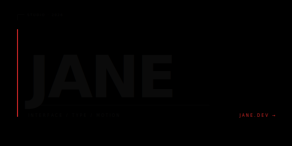
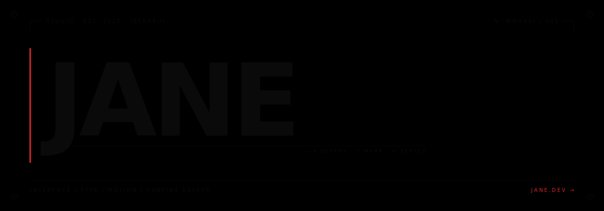

# Liquid Morph Wordmark



> A brutalist Swiss wordmark with a single morphing glyph that interpolates through six geometric states forever. Path interpolation done right — every transition is one continuous curve, no keyframe pop.

**Difficulty:** Advanced
**External services:** none — fully self-contained SVG
**Tags:** `avant-garde` `path-morphing` `swiss-brutalist` `editorial` `restrained`

## Why this is different

Most "animated logos" on GitHub READMEs are GIFs or sprite-flips. This one uses **SVG path morphing via `<animate attributeName="d">`** — the path's command list interpolates between six topologically-equivalent forms. The morph is mathematically smooth: every cubic bezier handle linearly interpolates to its counterpart in the next state, every frame is a real, never-recorded shape.

The tight constraint that makes it work: every state in the `values` list must have **identical command structure** (same number of `C` curves, in the same order). The five states here are all 4-cubic-bezier closed shapes — so they morph cleanly. Break that rule and the browser falls back to keyframe-snapping, which looks broken.

The cherry on top: a dashed outline path morphs in parallel + slowly rotates 360° over 60s. That's two SMIL primitives stacked: `<animate>` for path, `<animateTransform>` for rotation.

## Live showcase



## Setup

1. Download [`liquid-morph-wordmark.svg`](../../../assets/avant-garde/liquid-morph-wordmark.svg) into `./assets/liquid-morph-wordmark.svg` of your profile repo.
2. Edit the wordmark `<text>` — replace `JANE` with the four-letter version of your name. **Four letters is the magic number** — three feels stunted, five overflows the canvas at this size.
3. Edit the editorial mono details: `STUDIO · EST. 2017 · ISTANBUL`, `N° MMXXVI / 003`, the description line, the link. Keep everything in caps.
4. Optional: change the `#d62828` (signal red) to your accent. Stay saturated — pastels weaken the brutalist tension.
5. Commit. Done.

## Copy & Customize (paste into README.md)

```markdown
<p align="center">
  
</p>

---

<table border="0" align="center" width="80%">
  <tr>
    <td valign="top" width="60%">

### what

{{what_paragraph}}

### now

{{now_paragraph}}

### writing

{{writing_paragraph}}

    </td>
    <td valign="top" width="40%" align="right">
      <p><strong>SELECTED</strong><br>
      <code>01</code> &nbsp; <a href="{{work_one_url}}">{{work_one_name}}</a><br>
      <code>02</code> &nbsp; <a href="{{work_two_url}}">{{work_two_name}}</a><br>
      <code>03</code> &nbsp; <a href="{{work_three_url}}">{{work_three_name}}</a></p>

      <p><strong>FIND</strong><br>
      <a href="{{website_url}}">{{website}}</a><br>
      <a href="https://twitter.com/{{twitter}}">@{{twitter}}</a><br>
      <a href="mailto:{{email}}">{{email}}</a></p>
    </td>
  </tr>
</table>
```

## Placeholders

| Token                  | Description                                          | Example                      |
|------------------------|------------------------------------------------------|------------------------------|
| `{{name_short}}`       | Wordmark text (edit inside SVG)                      | `JANE`                       |
| `{{tagline}}`          | One-liner for accessibility alt                      | `studio of one`              |
| `{{what_paragraph}}`   | 1–2 sentences positioning                            | `An independent practice...` |
| `{{now_paragraph}}`    | 1–2 sentences current work                           | `Designing the system at...` |
| `{{writing_paragraph}}`| 1–2 sentences writing/output                         | `Notes on motion...`         |
| `{{work_one_name}}`    | First selected work                                  | `acme design system`         |
| `{{work_one_url}}`     | URL                                                  | `https://github.com/...`     |
| (etc. for two, three)  |                                                      |                              |
| `{{website}}`          | Domain                                               | `jane.dev`                   |
| `{{website_url}}`      | URL                                                  | `https://jane.dev`           |
| `{{twitter}}`          | Twitter without `@`                                  | `janedoe`                    |
| `{{email}}`            | Email                                                | `hello@jane.dev`             |

## Customization Tips

- **Don't rotate the wordmark.** The whole point is that the static type plays against the morphing glyph. If both move, neither lands. Restraint here is the design.
- **The cubic-bezier control points encode the personality.** If you want a *louder* morph, push the values further from the radius (e.g., `C 0 -88 ; 88 0 ; ...` for hard diamonds). For a *quieter* morph, keep all points close to the original circle and barely shift.
- **Five states minimum.** Three states make the cycle obvious. Five-to-eight states feel like a continuous evolution. Twelve gets noisy.
- **`calcMode="spline"` + `keySplines="0.4 0 0.2 1"`** is the easing that makes the morph feel material. Without it, the linear interpolation reads as robotic. The spline values are CSS's `cubic-bezier(0.4, 0, 0.2, 1)` — Material Design's "standard" curve.
- **Registration crosses are non-negotiable.** They're what makes this read as "designed by a designer", not "made in Canva." Print marks are the secret handshake.
- **Paper grain `feTurbulence` at 0.04 alpha.** Anything stronger looks dirty. Anything less is missed.
- **Don't put a stats card next to this.** It would read as a Silicon Valley resume next to a Hermès print. Use the right column for selected work + writing instead.

## Technical notes

The morph engine:

```svg
<path>
  <animate attributeName="d"
    values="<state1>; <state2>; <state3>; <state4>; <state5>; <state1>"
    dur="14s"
    repeatCount="indefinite"
    calcMode="spline"
    keySplines="0.4 0 0.2 1; 0.4 0 0.2 1; 0.4 0 0.2 1; 0.4 0 0.2 1; 0.4 0 0.2 1"
  />
</path>
```

Two iron rules of SVG path morphing:
1. **Same command structure across all states.** All five `values` here are `M ... C ... C ... C ... C ... Z` — same letters, same order, only the numbers differ. Browsers interpolate the numbers; they cannot interpolate command shape.
2. **Match keySplines count to transition count.** With 5 states + a return to state 1, there are 5 transitions, so `keySplines` has 5 semicolon-separated bezier triples.

The dashed-outline rotates 360° every 60s via `<animateTransform>`:

```svg
<animateTransform attributeName="transform" type="rotate"
                  from="0" to="360" dur="60s" repeatCount="indefinite"/>
```

Pairing one slow rotation with the morph creates **harmonic motion** — the visitor's eye reads the morph + rotation as a single living thing, not two animations.

## Credits

- SVG SMIL `<animate>` and `<animateTransform>` (W3C SVG 1.1)
- Editorial composition inspired by Swiss-brutalist print conventions
- Original composition for this kit. CC0 — copy, modify, ship.
