# Neural Pulse Lattice


> A 10-node graph with 9 signals racing along its edges in real time. `<animateMotion>` + `<mpath>` + parallax node halos. Reads like a particle-physics readout. Says "I work on hard things."

**Difficulty:** Advanced
**External services:** none — fully self-contained SVG
**Tags:** `avant-garde` `network-graph` `animatemotion` `tech-luminous` `data-vis`

## Why this is different

This is the deepest pure-SVG technique on this kit. **Every signal pulse is a `<circle>` whose position is driven by `<animateMotion>` referencing an `<mpath>` to one of the edge paths.** The edge paths are defined once in `<defs>` with `id`s; the visible edge lines and the moving signals both reference the same `id`. That's elegant — change one path and both visual + motion update.

What you'd otherwise need WebGL or D3 for is happening here in plain XML, no script:

- **10 nodes** with breathing halo (radius animation, staggered phase)
- **15 edges** (`<path id="e*">` definitions, `<use>` for visible rendering)
- **9 simultaneous signal pulses** (each a `<circle>` with its own `<animateMotion>` and `<animate opacity>` for fade-in/out at edge boundaries)
- **Background scan band** sweeping vertically (subtle `<rect>` with `y` animating across viewport)
- **Status indicator** with blinking node + uptime line

## Live showcase



## Setup

1. Download [`neural-pulse-lattice.svg`](../../../assets/avant-garde/neural-pulse-lattice.svg) into `./assets/neural-pulse-lattice.svg` of your profile repo.
2. Edit the side panel `<text>` elements: name (`Jane Doe`), role (`FRONTEND · INTERFACE · MOTION`), the five stat rows (nodes/edges/signals/commits/prs), and the contact line.
3. Optional: change the warm hub-node color (`#fef3c7`) to your accent — these are the "important nodes" your eye lands on.
4. Optional: shift palette by changing `#4fbcff` (electric blue) and `#a78bfa` (violet) globally. Keep the contrast high — this is data-vis, not interior decor.
5. Commit.

## Copy & Customize (paste into README.md)

```markdown
<p align="center">
  
</p>

### transmission

{{transmission_paragraph}}

### nodes (currently active)

- `n01` · {{node_one_label}} — {{node_one_text}}
- `n02` · {{node_two_label}} — {{node_two_text}}
- `n03` · {{node_three_label}} — {{node_three_text}}

### endpoints

[`{{website}}`]({{website_url}}) · [`@{{twitter}}`](https://twitter.com/{{twitter}}) · [`{{email}}`](mailto:{{email}})

```

## Placeholders

| Token                         | Description                              | Example                              |
|-------------------------------|------------------------------------------|--------------------------------------|
| `{{name}}`                    | Display name (edit inside SVG)           | `Jane Doe`                           |
| `{{role}}`                    | Role line in caps (edit inside SVG)      | `FRONTEND · INTERFACE · MOTION`      |
| `{{stats_*}}`                 | The 5 stat rows (edit inside SVG)        | `nodes / 10`                         |
| `{{transmission_paragraph}}`  | 1–2 sentence bio                         | `I build the kind of...`             |
| `{{node_one_label}}`          | Active project label                     | `acme/design-system`                 |
| `{{node_one_text}}`           | Active project description               | `tokens shipped to 14 product teams` |
| (etc. for two, three)         |                                          |                                      |
| `{{website}}`                 | Domain                                   | `jane.dev`                           |
| `{{website_url}}`             | URL                                      | `https://jane.dev`                   |
| `{{twitter}}`                 | Twitter without `@`                      | `janedoe`                            |
| `{{email}}`                   | Email                                    | `hello@jane.dev`                     |

## Customization Tips

- **Hub nodes are the focal points.** `n6` and `n9` in the SVG are larger (radius 18-20) with warm `#fef3c7` cores — this draws the eye to two specific spots in an otherwise uniform graph. If you customize, keep exactly two hubs. One feels lonely, three confuses the hierarchy.
- **9 signals is the right count.** Below 6 the graph feels half-asleep; above 12 it becomes a screensaver. The current rhythm averages ~5 active signals visible at any moment because of staggered begin times — perfectly busy.
- **Don't sync signal durations.** All 9 signals have different `dur` (1.6s to 2.6s) and different `begin` offsets. This intentional desynchronization is what stops the graph from looking like a metronome.
- **Edge fade timing.** The `keyTimes="0;0.1;0.85;1"` on opacity means the signal fades in over the first 10% and out over the last 15% of its journey. This hides the sharp pop-in/out at edge endpoints. Don't change to linear — it'll look broken.
- **The status pill (bottom left) is the personality.** "SYSTEM NOMINAL · LATENCY 12ms" is dry humor. Replace with an honest line — your actual ping to your favorite server, current local time, weather. Avoid generic ("ONLINE", "READY"); be specific.
- **Don't add a typing SVG above this.** This template is already heavy on movement. Pair it with prose — sober, technical sentences that match the data-readout tone.
- **Mobile note.** `<animateMotion>` is supported across all modern mobile browsers including the GitHub mobile app. The 9 simultaneous animations cost roughly the same as a single video tag — well within budget.

## Technical notes

The minimal `animateMotion` recipe (every signal is one of these):

```svg
<defs>
  <path id="np-e1" d="M 120 80 L 240 140"/>
</defs>

<circle r="3.2" fill="#7ddbff">
  <animateMotion dur="1.8s" repeatCount="indefinite">
    <mpath href="#np-e1"/>
  </animateMotion>
  <animate attributeName="opacity"
           values="0;1;1;0" keyTimes="0;0.1;0.85;1"
           dur="1.8s" repeatCount="indefinite"/>
</circle>
```

Two animations on one element, both with the same `dur` so they stay in sync — `animateMotion` moves the dot along the edge, `animate opacity` fades it at the boundaries. This pair is the building block; copy it, change `href` and timing, get a new signal.

The `<use href="#np-e1"/>` pattern for visible edges (versus `<line>`) is what lets one path serve both rendering and motion — a single source of truth.

## Credits

- SVG `<animateMotion>` + `<mpath>` (W3C SVG 1.1)
- Composition pattern adapted from particle-physics event displays (CERN, Atlas)
- Original composition for this kit. CC0 — copy, modify, ship.
